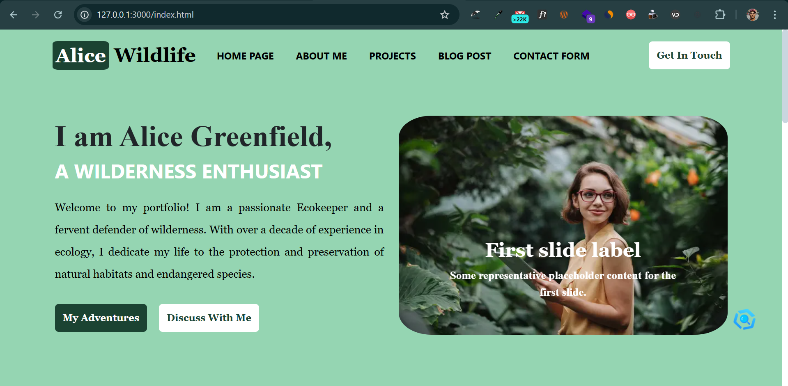
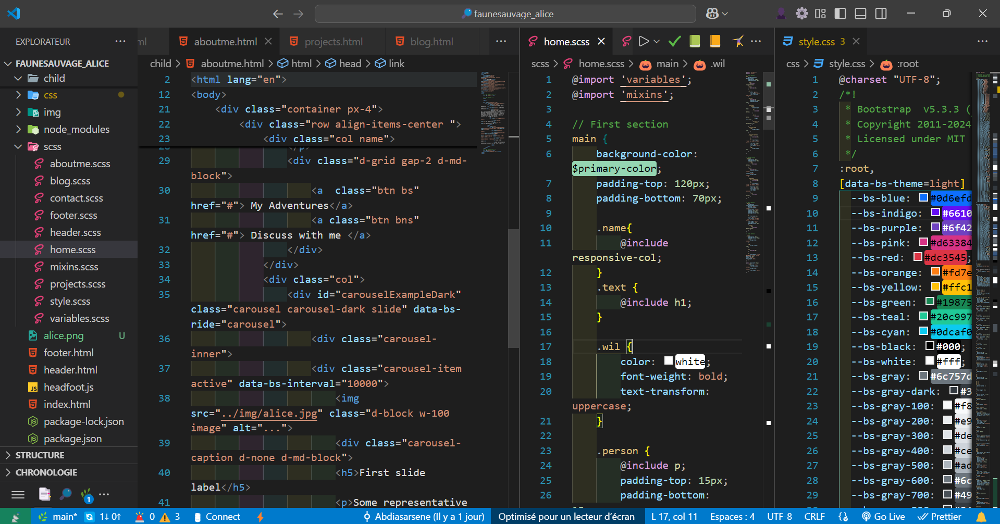

# Portfolio for Alice Greenfield - Wildlife Conservation

Welcome to the GitHub repository for Alice Greenfield's professional portfolio. This website showcases Alice's expertise, projects, and dedication to wildlife conservation.

## 🌿 About the Project
This portfolio website highlights Alice Greenfield's work as a wildlife conservation expert. The site provides insights into her projects, research, and conservation efforts, offering a visually appealing and informative experience for visitors.



## ✨ Features
- **Home Page**: Engaging introduction with a welcome message and key highlights.
- **About Page**: Detailed biography, skills, and certifications.
- **Projects Page**: Showcasing major conservation projects, case studies, and research publications.
- **Blog**: Insights and updates on wildlife conservation topics.
- **Contact Page**: Form for inquiries and links to professional networks.
- **Responsive Design**: Optimized for mobile, tablet, and desktop devices.
- **SEO Optimized**: Enhanced visibility on search engines.
- **Analytics Integration**: Tracking visitor behavior and site performance.

## 🛠️ Technologies Used
- **Sass**: For enhanced CSS styling and maintainability.
- **Bootstrap**: To create a responsive and user-friendly design.
- **JavaScript**: For interactivity and dynamic elements.
- **HTML5 & CSS3**: The foundation of the website's structure and styling.

  

## 🚀 Installation
To run this project locally, follow these steps:

1. **Clone the repository**
   ```sh
   git clone https://github.com/yourusername/Portfolio_for_Alice_Wildlife_Conservation.git
   ```
2. **Navigate into the project folder**
   ```sh
   cd Portfolio_for_Alice_Wildlife_Conservation
   ```
3. **Install dependencies (if applicable)**
   ```sh
   npm install
   ```
4. **Compile Sass files** (if you're making changes to styles)
   ```sh
   sass --watch assets/scss/style.scss:assets/css/style.css
   ```
5. **Open the project in a browser**
   Simply open `index.html` in your preferred browser.

## 📌 How to Contribute
If you would like to contribute to improving this portfolio, feel free to:
- Fork the repository.
- Create a new branch.
- Make your changes and push them.
- Submit a pull request!

## 📧 Contact
For inquiries or collaboration opportunities, visit the **Contact Page** on the website or reach out via email.

---

### "Working together, we can create a future where people and nature coexist in harmony." - Alice Greenfield
